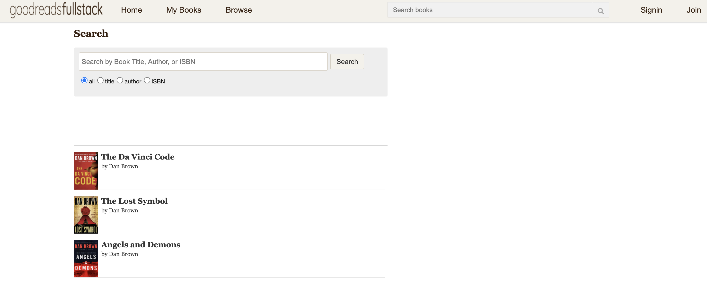

# Goodreadsfullstack

Goodreadsfullstack is a full-stack, single-page-application clone of Goodreads. Users can view a list of books from our data base, search up books, create bookshelves and add books to them.Each book can be commented and reviewed. [Live demo](https://good-reads-full-stack.herokuapp.com/#/)

## Technologies 
* Frontend:
    React,
    Redux,
    HTML 5,
    CSS 3
* Backend:
    Ruby on Rails,
    PostgreSQL
* Heroku (website hosting)

## Features
* Full user authentication (sign-up, login, logout) with security
* Ability for a demo user to login to check out the site
* Search functionality, ability to search books up based on the books title, author or isbn
* Ability for clients to create their bookshelves 
* Ability to mark a book as read, want to read, currently reading or to add a book to one of the clients bookshelves
* Ability for clients to review and/or rate a book as well as to read all other reviews on that book

## Splash page and search
* Users can search up books even though they are not logged in.

* Users can choose if they want to search based on the title, author, isbn or all.

## User authentication 

* User can create and sign up on the app
* Error handling and validations with log in and sign up

## Home page
* Logged in users can search up books, look up all their bookshelves and their content as well as books and the books reviews and ratings.

## Bookshelves 

* Clients can create bookshelves and add books to different shelves 

## Books 

* Clients are able to put a status on a books, read, want to read or currently reading. 
* Clients can add a book to one of their bookshelves 
* Clieants can review or rate a book and they can later edit it. 

## Initial Implementation Timeline 

10 days 

